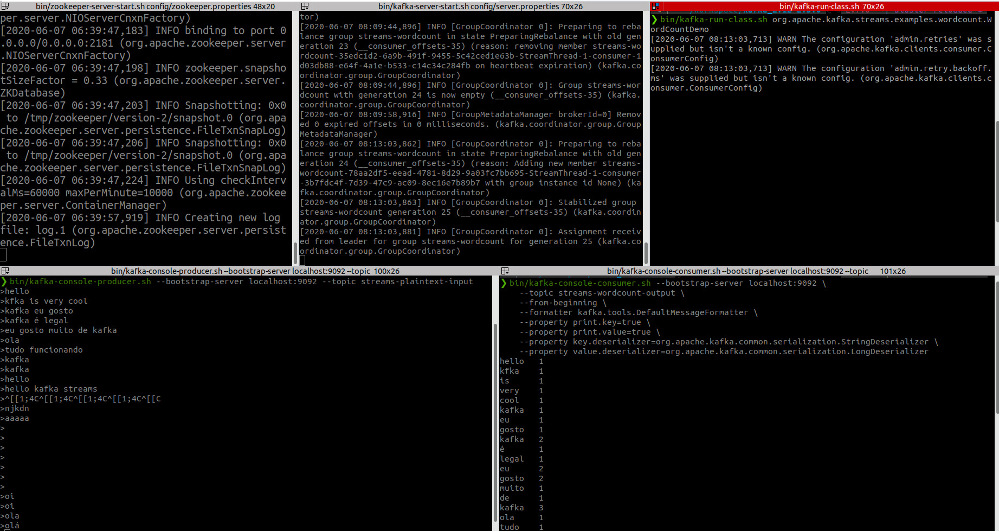

# WordCountDemo

+ https://kafka.apache.org/25/documentation/streams/quickstart

## Following :point_up

The real code is here: 

```sh
ls ~/workspace/kafka_2.12-2.5.0/libs/kafka-streams-examples-2.5.0.jar 
```

